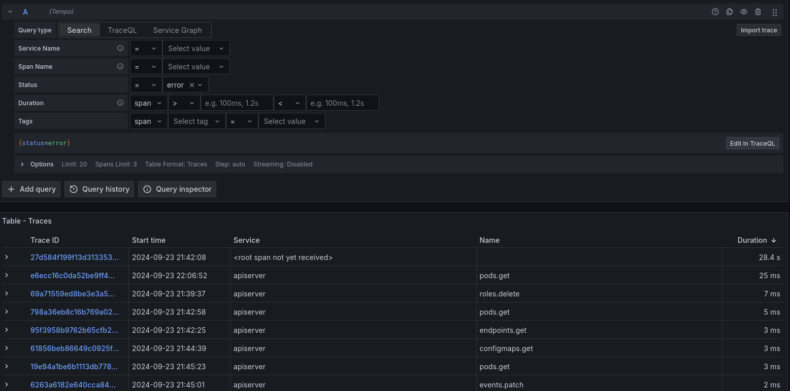
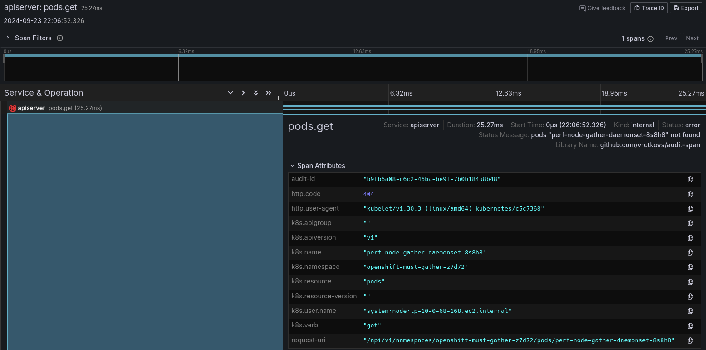

# Audit Log to Traces

This app parses audit log, converts them into traces and sends it to Jaeger-compatible storage. 
Grafana is used as a tool to query and find strange traces.

Along with Tempo the tool also sends data to Loki, so that audit data could be converted into metrics 
or properly grepped.

## Howto

Start grafana stack:
```
podman play k8s grafana-stack.yaml
```

Start the app and pass it the URL of the auditlogs:
```
go run -mod vendor . --otlp-addr=localhost:4317 --prow-job=https://prow.ci.openshift.org/view/gs/test-platform-results/logs/periodic-ci-openshift-release-master-ci-4.17-e2e-azure-ovn-upgrade/1835770305428066304
```

Open http://localhost:3000 in browser (default login is `admin`/`admin`) and use Explore view to 
lookup audit log




Apart from Prow URL the app can work on already extracted audit log dir:
```
go run -mod vendor . --otlp-addr=localhost:4317 --audit-log-dir=/tmp/audit-span696690513
```
